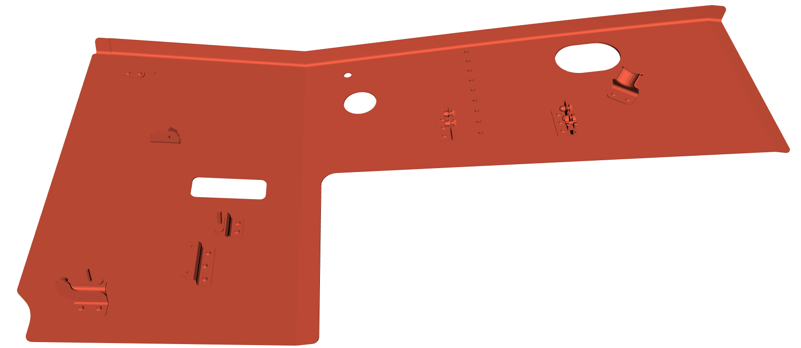
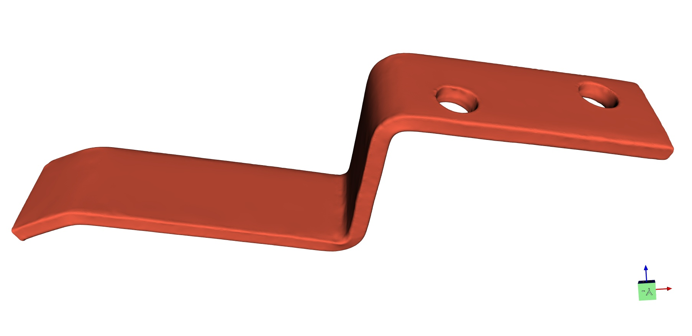

# Données de tests

## Présentation

#### *Duct Elbows*

* **Présentation :** c'est un demi coude d'un conduit d'air chaud de mât réacteur de A320 en AISI 316 voir un Inconel 718. Cette pièce est utilisée comme exemple dans dcShapeDetector.
* **Propriétaire de la pièce :** Luc Penazzi < luc.penazzi@mines-albi.fr >
* **Détails :**
	* Type : nuage de points / maillage triangulaire 
	* Scanné avec : Artec EVA
	* Extensions : .pcd / .ply
	* Taille de fichier : ≈ 2,5 Mo
	* Nombre de points 3D : 86373 points
	* Résolution 3D : 1.594 mm
* **Scanné par :** Hamdi Ben Abdallah < hbenabda@mines-albi.fr, hba@diotasoft.com >

#### *Stanford Lucy statue*

* **Propriétaire de la pièce :** *Stanford Computer Graphics Lab*
* **Détails :**
	* Modèle de référence :
		* Type : maillage triangulaire 
		* Extension : .obj
		* Taille de fichier : ≈ 227 Ko
		* Nombre de points : 2502 points
		* Résolution 3D :  0.012 mm
	* Modèle de test :
		* Type : nuage de points / maillage triangulaire 
		* Scann avec : inconnu
		* Extension : .pcd / .obj
		* Taille : ≈ 1,5 Mo
		* Nombre de points 3D : 17873 points
		* Résolution : 0.0029 mm
	* **Scanné par :** *Stanford University Computer Graphics Laboratory*

#### *Bunny*

* **Propriétaire de la pièce :** *Stanford 3D Scanning Repository*
* **Détails :**
	* Modèle de référence :
		* Type : maillage triangulaire 
		* Extension : .ply
		* Taille de fichier : ≈ 965 Ko
		* Nombre de points : 26186 points
		* Résolution 3D :  0.0134 mm
	* Modèle de test artificiel :
		* Type : nuage de points
		* Scann avec : inconnu
		* Extension : .pcd
		* Taille : ≈ 1,12 Mo
		* Nombre de points 3D : 36025 points
		* Résolution : 0.0183 mm

#### *Max Planck bust*

* **Propriétaire de la pièce :** *Max Planck  Institute (MPI)*
* **Détails :**
	* Modèle de référence :
		* Type : maillage triangulaire 
		* Extension : .obj
		* Taille de fichier : ≈ 249 Ko
		* Nombre de points 3D  :  2686 points
		* Résolution 3D :  0.027 mm
	* Modèle de test :
		* Type : nuage de points / maillage triangulaire 
		* Scanné avec : inconnu
		* Extension : .pcd / .obj
		* Taille : ≈ 1,3 Mo
		* Nombre de points 3D : 31894 points
		* Résolution : 0.0046 mm
	* **Scanné par :** *Max Planck  Institute (MPI)*

#### *Horse*

* **Propriétaire de la pièce :** *The Visualisation Toolkit (VTK)*
* **Détails :**
	* Modèle de référence :
		* Type : maillage triangulaire 
		* Extension : .obj
		* Taille de fichier : ≈ 2,42 Mo
		* Nombre de points 3D  :  33936 points
		* Résolution 3D :  0.0006 mm
	* Modèle de test :
		* Type : nuage de points
		* Scanné avec : inconnu
		* Extension : .pcd
		* Taille : ≈ 4,75 Mo
		* Nombre de points 3D : 128499 points
		* Résolution : 0.0002 mm

#### *Beautiful girl*

* **Propriétaire de la pièce :** *TESTIA*
* **Détails :**
	* Type : nuage de points / maillage triangulaire
	* Scanné avec : Artec EVA
	* Extension : .pcd / .ply
	* Taille de fichier : ≈ 25 Mo
	* Nombre de points 3D : 258387 points
	* Résolution 3D :  0.153 mm

#### *Plaque moire view*

* **Propriétaire de la pièce :** *TESTIA*
* **Détails :**
	* Type : nuage de points / maillage triangulaire
	* Scanné avec : Artec Space Spider
	* Extension : .pcd / .ply
	* Taille de fichier : ≈ 8,3 Mo
	* Nombre de points 3D : 231781 points
	* Résolution 3D :  0.256 mm
* **Scanné par :** Hamdi Ben Abdallah < hbenabda@mines-albi.fr, hba@diotasoft.com >

#### *Plaque DIOTA*

* **Propriétaire de la pièce :** DIOTA < bdo@diotasoft.com >
* **Détails :**
	* Type : maillage triangulaire
	* Extension : .stl
	* Taille de fichier : ≈ 1,86 Mo
	* Nombre de points 3D : 5001 points
	* Résolution 3D :  1.146 mm

#### *Simple Bracket*

* **Propriétaire de la pièce :** Geomagic
* **Détails :**
	* Modèle de référence :
		* Type : maillage triangulaire 
		* Extension : .obj
		* Taille de fichier : ≈ 8 Mo
		* Nombre de points : 99998 points
		* Résolution 3D :  0.3080 mm
	* Modèle de test :
		* Type : maillage triangulaire 
		* Scanné avec : inconnu
		* Extension : .obj
		* Taille : ≈ 19 Mo
		* Nombre de points 3D : 199040 points
		* Résolution : 0.2114 mm
	* **Scanné par :** Geomagic

